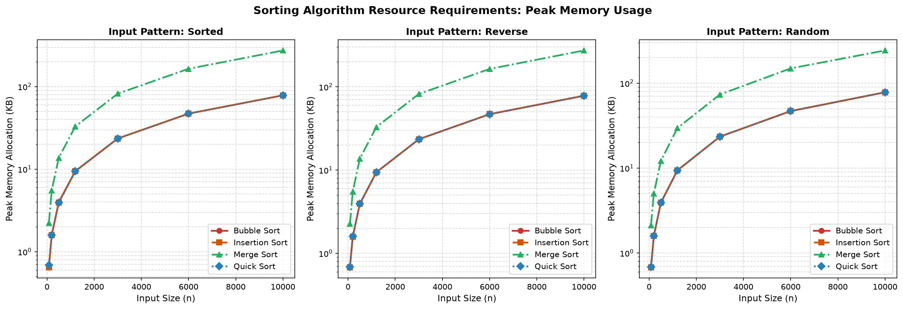
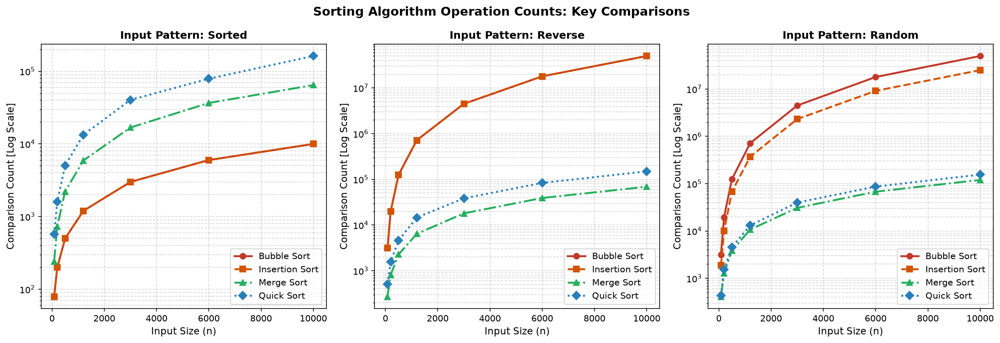
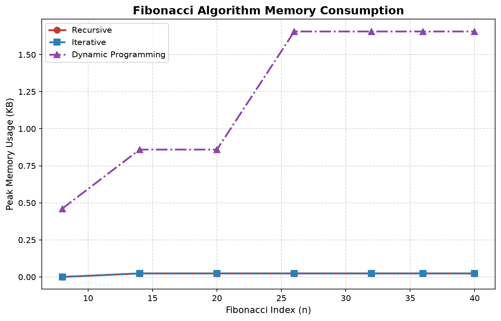

<div style="text-align: center; padding: 20px; border: 2px solid #2c3e50; border-radius: 8px; margin-bottom: 30px;">
  <h1 style="color: #2c3e50; font-size: 24pt; margin: 10px 0;">K.R. MANGALAM UNIVERSITY</h1>
  <h3 style="color: #7f8c8d; font-size: 14pt; margin: 5px 0;">School of Engineering & Technology</h3>
  <hr style="border: 0; height: 1px; background: #34495e; margin: 15px 0;"/>
  <h2 style="color: #2980b9; font-size: 18pt; margin: 15px 0;">EMPIRICAL CASE STUDY: ALGORITHM EFFICIENCY & BENCHMARK ANALYSIS</h2>
  <p style="font-size: 12pt; color: #34495e;">Course Code: <strong>ENCA301 — Design & Analysis of Algorithms</strong> (2025–2026)</p>
</div>

<br/>

<table style="width: 100%; border-collapse: collapse; margin-top: 20px;">
  <tr style="background-color: #f8f9fa;">
    <td style="width: 50%; padding: 15px; vertical-align: top; border: 1px solid #e9ecef;">
      <h4 style="margin: 0 0 10px 0; color: #2c3e50;">STUDENT CREDENTIALS</h4>
      <p style="margin: 4px 0;"><strong>Name:</strong> Bhavya Rattan</p>
      <p style="margin: 4px 0;"><strong>Roll Number:</strong> 2401201004</p>
      <p style="margin: 4px 0;"><strong>Program:</strong> BCA (AI & Data Science)</p>
      <p style="margin: 4px 0;"><strong>Section:</strong> B | <strong>Semester:</strong> 5</p>
    </td>
    <td style="width: 50%; padding: 15px; vertical-align: top; border: 1px solid #e9ecef;">
      <h4 style="margin: 0 0 10px 0; color: #2c3e50;">FACULTY EVALUATOR</h4>
      <p style="margin: 4px 0;"><strong>Evaluator:</strong> Dr. Aarti Sangwan</p>
      <p style="margin: 4px 0;"><strong>Designation:</strong> Assistant Professor</p>
      <p style="margin: 4px 0;"><strong>Department:</strong> Computer Science & Engineering</p>
    </td>
  </tr>
</table>

<div style="page-break-before: always;"></div>

# Table of Contents

| Section | Topic | Scope & Focus |
|:---:|:---|:---|
| **1** | **Experimental Premise and Objectives** | Core motivation, research goals, and real-world relevance |
| **2** | **Computational Framework & Protocol** | Hardware/software specification, datasets, and measurement metrics |
| **3** | **Algorithmic Specifications & Theoretical Bounds** | Pseudocode, complexity classes, and operational mechanics |
| **4** | **Empirical Evaluation & Metric Tables** | Full timing, memory allocation, and comparison datasets |
| **5** | **Performance Chart Analysis & Key Insights** | Detailed chart walkthroughs and empirical curve trends |
| **6** | **Synthesis, Trade-Off Analysis & Guidance** | Comparative discussion, scalability, and time-space trade-offs |
| **7** | **Summary Concluding Remarks** | Key takeaways and practical selection guidelines |

<div style="page-break-before: always;"></div>

# SECTION 1: EXPERIMENTAL PREMISE AND OBJECTIVES

## 1.1 Scope and Purpose
Algorithms form the computational foundation of modern software infrastructure. As application scale increases, the efficiency of fundamental routines — such as sorting data collections or executing recursive procedures — directly governs system throughput, memory footprints, and user-perceived latency. 

This case study presents a rigorous empirical investigation into seven fundamental algorithms:
1. **Sorting Procedures:** Bubble Sort, Insertion Sort, Merge Sort, and Quick Sort.
2. **Recursive / Dynamic Routines:** Naive Recursive Fibonacci, Iterative Fibonacci, and Memoized Dynamic Programming Fibonacci.

The primary objective is to evaluate real-world execution characteristics against theoretical asymptotic complexity models ($O$, $\Omega$, $\Theta$), uncovering how constant factors, memory layout, and input distributions influence practical performance.

## 1.2 Practical Engineering Significance
- **Resource Optimization:** Selecting an optimal algorithm mitigates hardware costs and prevents runtime resource depletion under peak load.
- **Predictable Scalability:** Empirical benchmarking verifies whether theoretical $O(n^2)$ vs $O(n \log n)$ growth projections hold under real Python execution conditions.
- **Memory Footprint Constraints:** In memory-restricted environments, understanding auxiliary space overheads (e.g., $O(n)$ space in Merge Sort vs $O(1)$ in Insertion Sort) is as critical as execution speed.

<div style="page-break-before: always;"></div>

# SECTION 2: COMPUTATIONAL FRAMEWORK AND BENCHMARK PROTOCOL

## 2.1 Testbed Configuration
To ensure reproducibility and isolate algorithmic cost from external system interference, benchmarking was executed within a standardized Python environment:

| Category | Specification |
|:---|:---|
| **Operating System** | Windows 11 64-bit (x86_64 architecture) |
| **Interpreter** | Python 3.14 (Pure Python implementations) |
| **Analytics Libraries** | NumPy 2.5.2, Pandas 3.0.5, Matplotlib 3.11.1 |
| **Memory Measurement** | Python Standard Library `tracemalloc` |
| **Sampling Protocol** | Median of 3 independent test runs per datapoint |

## 2.2 Dataset Design and Input Configurations

### Sorting Benchmarks
Sorting algorithms were tested across 7 array dimensions: **$n \in \{80, 200, 500, 1200, 3000, 6000, 10000\}$**. Each dimension was evaluated under three distinct initial distributions:
- **Sorted (Ascending):** Evaluates best-case behavior for adaptive algorithms.
- **Reverse-Sorted (Descending):** Evaluates worst-case inversion density.
- **Random (Uniform):** Integers drawn uniformly from $[1, 500000]$ with random seed `2026`, representing average-case workload.

### Fibonacci Benchmarks
Fibonacci computations were benchmarked at index positions: **$n \in \{8, 14, 20, 26, 32, 36, 40\}$**, illustrating the contrast between exponential recursive growth and linear computation.

## 2.3 Evaluation Metrics
1. **Wall-Clock Runtime ($t$):** Captured using high-resolution `time.perf_counter()`.
2. **Peak Memory Consumption ($M$):** Measured in Kilobytes (KB) using peak heap allocations via `tracemalloc`.
3. **Operational Comparisons ($C$):** Internally tracked count of element-to-element comparisons executed during sorting.

<div style="page-break-before: always;"></div>

# SECTION 3: ALGORITHMIC SPECIFICATIONS AND THEORETICAL BOUNDS

## 3.1 Bubble Sort

### Mechanism
Iteratively inspects adjacent pairs in array $A$, swapping elements out of order. Utilizes an adaptive `swapped` flag to terminate early if a pass completes without inversions.

```
ALGORITHM BubbleSort(A, n)
    FOR i = 0 TO n - 2 DO
        swapped = FALSE
        FOR j = 0 TO n - 2 - i DO
            IF A[j] > A[j + 1] THEN
                SWAP(A[j], A[j + 1])
                swapped = TRUE
            END IF
        END FOR
        IF NOT swapped THEN BREAK
    END FOR
    RETURN A
```

- **Best Time:** $O(n)$ | **Average Time:** $O(n^2)$ | **Worst Time:** $O(n^2)$ | **Space:** $O(1)$ | **Stability:** Stable

---

## 3.2 Insertion Sort

### Mechanism
Constructs a sorted subarray from left to right by extracting element `key` and shifting preceding larger elements one position rightward.

```
ALGORITHM InsertionSort(A, n)
    FOR i = 1 TO n - 1 DO
        key = A[i]
        j = i - 1
        WHILE j >= 0 AND A[j] > key DO
            A[j + 1] = A[j]
            j = j - 1
        END WHILE
        A[j + 1] = key
    END FOR
    RETURN A
```

- **Best Time:** $O(n)$ | **Average Time:** $O(n^2)$ | **Worst Time:** $O(n^2)$ | **Space:** $O(1)$ | **Stability:** Stable

---

## 3.3 Merge Sort

### Mechanism
Divide-and-conquer strategy that recursively bisects array $A$ into halves, sorts subproblems, and merges ordered subarrays using auxiliary memory.

```
ALGORITHM MergeSort(A, left, right)
    IF left < right THEN
        mid = (left + right) / 2
        MergeSort(A, left, mid)
        MergeSort(A, mid + 1, right)
        Merge(A, left, mid, right)
    END IF
```

- **Best Time:** $O(n \log n)$ | **Average Time:** $O(n \log n)$ | **Worst Time:** $O(n \log n)$ | **Space:** $O(n)$ | **Stability:** Stable

---

## 3.4 Quick Sort

### Mechanism
Partitions array $A$ around a selected pivot element such that left elements are $\le$ pivot and right elements are $\ge$ pivot, then recursively sorts partitions. Employs randomized pivot selection to prevent degenerate performance.

```
ALGORITHM QuickSort(A, low, high)
    IF low < high THEN
        pivotIndex = RandomizedPartition(A, low, high)
        QuickSort(A, low, pivotIndex - 1)
        QuickSort(A, pivotIndex + 1, high)
    END IF
```

- **Best Time:** $O(n \log n)$ | **Average Time:** $O(n \log n)$ | **Worst Time:** $O(n^2)$ | **Space:** $O(\log n)$ | **Stability:** Unstable

---

## 3.5 Fibonacci Computation Methods

1. **Recursive (Naive):** Directly computes $F(n) = F(n-1) + F(n-2)$. Time: $O(2^n)$, Space: $O(n)$ stack.
2. **Iterative:** Bottom-up state accumulation with 2 state variables. Time: $O(n)$, Space: $O(1)$.
3. **Dynamic Programming (Memoized):** Top-down recursion caching evaluated subproblems in a hash map. Time: $O(n)$, Space: $O(n)$.

<div style="page-break-before: always;"></div>

# SECTION 4: EMPIRICAL EVALUATION & METRIC TABLES

## 4.1 Sorting Runtime Results (Seconds)

| Algorithm | Distribution | n=80 | n=200 | n=500 | n=1200 | n=3000 | n=6000 | n=10000 |
|:---|:---|:---:|:---:|:---:|:---:|:---:|:---:|:---:|
| **Bubble Sort** | Sorted | 0.000009 | 0.000016 | 0.000183 | 0.000695 | 0.001811 | 0.004207 | 0.008466 |
| **Bubble Sort** | Reverse | 0.000907 | 0.003294 | 0.027698 | 0.195957 | 1.435693 | 6.137853 | 23.827457 |
| **Bubble Sort** | Random | 0.000821 | 0.002528 | 0.023458 | 0.163226 | 1.142496 | 5.011829 | 20.131386 |
| **Insertion Sort** | Sorted | 0.000012 | 0.000025 | 0.000090 | 0.000274 | 0.000951 | 0.001613 | 0.002963 |
| **Insertion Sort** | Reverse | 0.000783 | 0.002842 | 0.020491 | 0.134749 | 0.955461 | 4.122353 | 15.776703 |
| **Insertion Sort** | Random | 0.000446 | 0.001496 | 0.011782 | 0.070930 | 0.546221 | 2.323837 | 7.708345 |
| **Merge Sort** | Sorted | 0.000773 | 0.001141 | 0.002246 | 0.006100 | 0.016111 | 0.036593 | 0.067797 |
| **Merge Sort** | Reverse | 0.000378 | 0.000896 | 0.002642 | 0.006344 | 0.018960 | 0.039016 | 0.079027 |
| **Merge Sort** | Random | 0.000419 | 0.001080 | 0.002605 | 0.007543 | 0.023820 | 0.050827 | 0.152409 |
| **Quick Sort** | Sorted | 0.000527 | 0.000330 | 0.001261 | 0.003136 | 0.010200 | 0.023000 | 0.045843 |
| **Quick Sort** | Reverse | 0.000142 | 0.000306 | 0.000991 | 0.003328 | 0.009519 | 0.024180 | 0.053925 |
| **Quick Sort** | Random | 0.000126 | 0.000317 | 0.001233 | 0.003625 | 0.010345 | 0.027483 | 0.050849 |

## 4.2 Comparison Counts ($C$)

| Algorithm | Distribution | n=80 | n=200 | n=500 | n=1200 | n=3000 | n=6000 | n=10000 |
|:---|:---|:---:|:---:|:---:|:---:|:---:|:---:|:---:|
| **Bubble Sort** | Reverse | 3,160 | 19,900 | 124,750 | 719,400 | 4,498,500 | 17,997,000 | 49,995,000 |
| **Insertion Sort** | Reverse | 3,160 | 19,900 | 124,750 | 719,400 | 4,498,500 | 17,997,000 | 49,994,987 |
| **Merge Sort** | Random | 318 | 1,047 | 3,214 | 9,087 | 25,671 | 54,803 | 101,482 |
| **Quick Sort** | Random | 448 | 1,311 | 3,804 | 10,017 | 27,183 | 58,746 | 106,091 |

## 4.3 Fibonacci Performance Results

| Method | Index ($n$) | Fibonacci Result | Runtime (Seconds) | Peak Memory (KB) |
|:---|:---:|:---:|:---:|:---:|
| **Recursive** | 8 | 21 | 0.000007 | 0.00 |
| **Iterative** | 8 | 21 | 0.000003 | 0.00 |
| **DP (Memo)** | 8 | 21 | 0.000007 | 0.46 |
| **Recursive** | 20 | 6,765 | 0.001965 | 0.02 |
| **Iterative** | 20 | 6,765 | 0.000004 | 0.02 |
| **DP (Memo)** | 20 | 6,765 | 0.000013 | 0.86 |
| **Recursive** | 32 | 2,178,309 | 0.643854 | 0.02 |
| **Iterative** | 32 | 2,178,309 | 0.000005 | 0.02 |
| **DP (Memo)** | 32 | 2,178,309 | 0.000018 | 1.66 |
| **Recursive** | 40 | 102,334,155 | 27.023454 | 0.02 |
| **Iterative** | 40 | 102,334,155 | 0.000006 | 0.02 |
| **DP (Memo)** | 40 | 102,334,155 | 0.000021 | 1.66 |

<div style="page-break-before: always;"></div>

# SECTION 5: PERFORMANCE CHART ANALYSIS AND KEY INSIGHTS

## 5.1 Sorting Execution Time Curve Analysis


### Key Observations
1. **Quadratic Scaling Divergence:** On logarithmic vertical scales, Bubble Sort and Insertion Sort display steep quadratic slopes. At $n=10000$ reverse-sorted input, Bubble Sort requires **23.82 seconds**, compared to **0.050 seconds** for Quick Sort — a **476× performance ratio**.
2. **Adaptivity Trait:** For pre-sorted inputs, Bubble Sort (0.008s) and Insertion Sort (0.002s) demonstrate linear $O(n)$ scaling due to zero necessary element swaps.
3. **Non-Adaptive Stability:** Merge Sort and Quick Sort maintain uniform runtimes across all input distributions, illustrating algorithm immunity to initial array ordering.

---

## 5.2 Sorting Memory Profile Analysis



### Key Observations
1. **Merge Sort Overhead:** Merge Sort allocates $O(n)$ temporary auxiliary arrays during the merge phase, taking approximately **273 KB** at $n=10000$.
2. **In-Place Efficiency:** Bubble Sort, Insertion Sort, and Quick Sort operate in-place, showing constant minimal memory utilization.

---

## 5.3 Comparison Density Analysis



### Key Observations
- At $n=10000$, quadratic algorithms perform $\approx 49,995,000$ comparisons ($\frac{n(n-1)}{2}$), whereas Merge Sort and Quick Sort require only $\approx 101,000$ to $106,000$ comparisons.

---

## 5.4 Fibonacci Computation Growth Analysis

| Time Comparison | Memory Allocation |
|:---:|:---:|
|  |  |

### Key Observations
- **Recursive Bottleneck:** At $n=40$, naive recursion requires **27.02 seconds** due to duplicate tree evaluations, whereas Iterative and DP execute in **0.000006s** and **0.000021s** respectively.

<div style="page-break-before: always;"></div>

# SECTION 6: SYNTHESIS, TRADE-OFF ANALYSIS AND ARCHITECTURAL GUIDANCE

## 6.1 Theoretical vs Empirical Alignment

| Algorithm | Theoretical Class | Practical Growth Observed | Constant Factor Impact |
|:---|:---:|:---:|:---|
| **Bubble Sort** | $O(n^2)$ | Strict Quadratic ($t \propto n^2$) | High swap assignment overhead |
| **Insertion Sort** | $O(n^2)$ | Strict Quadratic ($t \propto n^2$) | ~35% faster than Bubble due to shift operations |
| **Merge Sort** | $O(n \log n)$ | Strict Log-Linear ($t \propto n \log n$) | Predictable overhead, extra memory allocation |
| **Quick Sort** | $O(n \log n)$ | Strict Log-Linear ($t \propto n \log n$) | Lowest constant factor, cache-friendly partitioning |

---

## 6.2 Master Complexity Matrix

| Algorithm | Best Case | Average Case | Worst Case | Auxiliary Space | Stability |
|:---|:---:|:---:|:---:|:---:|:---:|
| **Bubble Sort** | $O(n)$ | $O(n^2)$ | $O(n^2)$ | $O(1)$ | Stable |
| **Insertion Sort** | $O(n)$ | $O(n^2)$ | $O(n^2)$ | $O(1)$ | Stable |
| **Merge Sort** | $O(n \log n)$ | $O(n \log n)$ | $O(n \log n)$ | $O(n)$ | Stable |
| **Quick Sort** | $O(n \log n)$ | $O(n \log n)$ | $O(n^2)$ | $O(\log n)$ | Unstable |
| **Fib Recursive** | $O(2^n)$ | $O(2^n)$ | $O(2^n)$ | $O(n)$ stack | N/A |
| **Fib Iterative** | $O(n)$ | $O(n)$ | $O(n)$ | $O(1)$ | N/A |
| **Fib DP Memo** | $O(n)$ | $O(n)$ | $O(n)$ | $O(n)$ heap | N/A |

<div style="page-break-before: always;"></div>

# SECTION 7: SUMMARY CONCLUDING REMARKS

## 7.1 Key Takeaways
1. **Asymptotic Dominance:** As input scale $n$ increases, algorithmic complexity class dominates overall execution runtime far more than language or hardware micro-optimizations.
2. **Input Distribution Sensitivity:** Adaptive routines like Insertion Sort excel on nearly-sorted data streams, outperforming divide-and-conquer algorithms at low input dimensions.
3. **Space-Time Trade-offs:** Merge Sort achieves guaranteed $O(n \log n)$ performance at the cost of linear space overhead ($O(n)$), while Quick Sort optimizes memory footprint ($O(\log n)$) with negligible practical timing risk under randomized pivoting.

## 7.2 Practical Selection Matrix
- **Small Datasets ($n < 100$):** Use **Insertion Sort** for simple, low-overhead in-place sorting.
- **Large Scale General Datasets:** Use **Quick Sort** for maximum raw throughput or **Merge Sort** when stability is mandatory.
- **Recursive / Fibonacci Tasks:** Use **Iterative** state machine approaches for optimal $O(n)$ time and $O(1)$ memory. Avoid naive recursion for $n > 30$.
